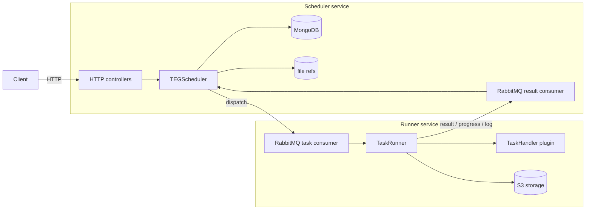

# Architecture overview

re-do is built around **hexagonal architecture** (ports and adapters). Business logic lives in `core/` and depends
only on interfaces. All I/O (databases, message brokers, HTTP, file storage) is implemented in adapter modules
behind those interfaces.

```
[ Driving adapter ] -> [ Use case ] -> [ Driven port interface ]
                                              ^
                                    [ Driven adapter (real or test double) ]
```

The dependency arrow always points inward. The domain never imports an adapter.

## Runtime topology



Two Spring Boot services run independently:

- **Scheduler** (`adapter_driving_scheduler_spring`) accepts the HTTP API and consumes runner results.
- **Runner** (`adapter_driving_runner_spring`) consumes task dispatches and executes plugin code.

They communicate only through RabbitMQ. The scheduler owns state in MongoDB; both share access to the S3 bucket
for file artefacts.

## Why hexagonal

- The use cases in `core/` are unit-tested with hand-written in-memory adapters (no Docker, no mocking library).
- Adapters can be swapped: every port has an in-memory implementation alongside the real one. Selection is via
  Spring properties (`scheduler.persistence.mode`, `scheduler.messaging.mode`, and so on).
- Adding a new transport or storage backend is a self-contained module that does not touch the core.

## Where to look

| Concern                          | Location                                               |
|----------------------------------|--------------------------------------------------------|
| Validation, dispatch, retries    | `core/src/main/.../scheduler/service/TEGScheduler.kt`  |
| Runner execution flow            | `core/src/main/.../runner/service/TaskRunner.kt`       |
| File upload use case             | `core/src/main/.../scheduler/service/UploadFileUseCase.kt` |
| HTTP controllers                 | `adapter_driving_scheduler_spring/.../controller/`     |
| RabbitMQ wiring                  | `adapter_common_rabbitmq_spring/`                      |
| MongoDB persistence              | `adapter_common_mongodb_spring/`                       |
| S3 storage                       | `adapter_common_s3/`                                   |

See [Modules](modules.md) for the full module map and [Testing](testing.md) for the rules that keep the boundary
honest.
