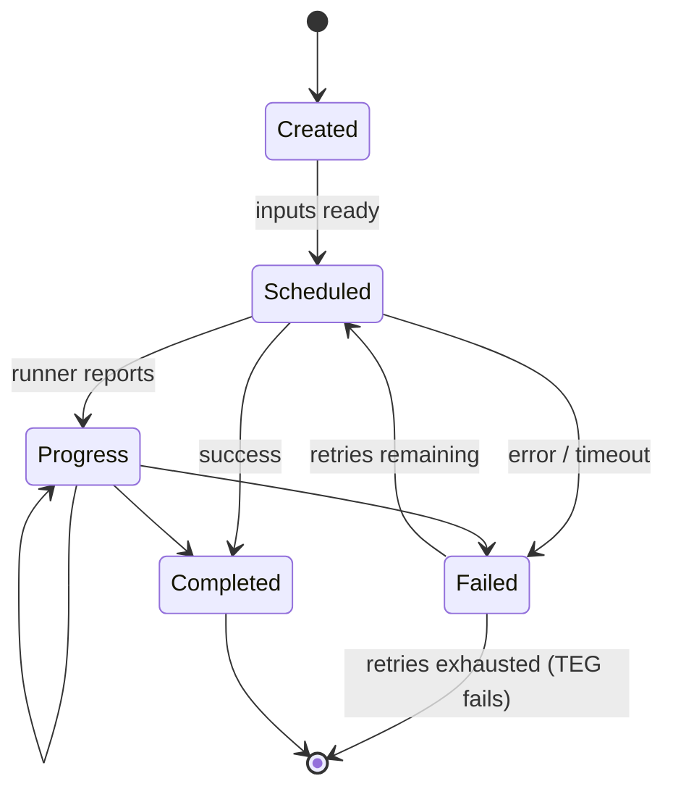

# TEG lifecycle

The scheduler is **event-sourced**. Every state change is appended to MongoDB as a `TEGEvent`. Current state is
derived by replaying events.

## Events

| Event                  | Emitted when                                                                                   |
|------------------------|------------------------------------------------------------------------------------------------|
| `SubmitterIdentity`    | TEG is accepted; records the caller principal and roles.                                       |
| `Created`              | Once per task at submission, carrying the task definition.                                     |
| `Scheduled`            | Task has been dispatched to a runner.                                                          |
| `Progress`             | Runner reports a progress percentage and a step label.                                         |
| `Log`                  | Runner emits a log line.                                                                       |
| `Completed`            | Runner returned a successful result; carries the produced artefacts.                           |
| `Failed`               | Runner returned a failure or the task timed out. Triggers a retry up to the configured limit. |
| `NoMoreTasksToSchedule`| All tasks are `Completed`. Terminal success state.                                             |
| `TEGFailed`            | A task exceeded its retry budget, or output artefacts did not conform. Terminal failure state. |

## Task state machine

A `Failed` event after a prior `Completed` for the same task is recorded but ignored for state purposes (treated as
a late or duplicate delivery).

## TEG terminal states

A TEG ends in exactly one of:

- `NoMoreTasksToSchedule` after every `Created` task has a matching `Completed`.
- `TEGFailed` if any task exhausts its retries or returns non-conforming outputs.

Once terminal, no further events are accepted for that `tegId`.

## Timeout sweep

`TEGScheduler.runTimeoutCheck` periodically scans for TEGs without a `NoMoreTasksToSchedule` or `TEGFailed` event,
finds `Scheduled` tasks past their declared timeout, and fails them. Failures then go through the normal retry
path.

## Concurrency

`handleTegUpdate` takes a mutual-exclusion lock per `tegId` before reading and writing events, so concurrent
runner messages for the same TEG are serialised.
