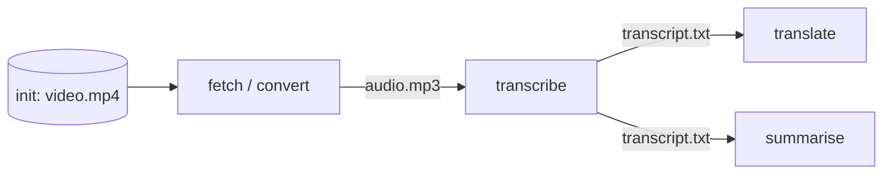

# Task Execution Graph (TEG)

A **TEG** is a directed acyclic graph where:

- **Nodes** are tasks.
- **Edges** are artefacts produced by one task and consumed by another.

A TEG is submitted in full, validated, then executed asynchronously. The scheduler dispatches tasks as soon as all
their inputs are available.

## Anatomy

- **Initial artefacts** (`initArtefacts`) are provided by the caller at submission time. They are the only inputs
  that have no producing task.
- **Starting tasks** are tasks whose inputs are all satisfied by initial artefacts (or that have no inputs at all).
  They are dispatched immediately after validation.
- A task is dispatched once **all** of its declared inputs have been produced. Tasks may run in parallel when their
  dependencies allow it.

## Validation rules

Before any task is dispatched, the scheduler verifies:

1. The task list is not empty.
2. Task names are unique within the TEG.
3. Artefact names produced as outputs are unique across the TEG.
4. Every declared task input has a producer (an initial artefact or another task's output).
5. There is at least one starting task.
6. The graph is acyclic.

Any failure returns `400 Bad Request` with a descriptive `cause`. See [error responses](../api/overview.md#errors).

## Identifiers

- A TEG is identified by a `tegId` (UUID), returned by `POST /api/v1/teg/schedule`.
- Tasks and artefacts are identified by **names** that the caller chooses. They must be unique within the TEG.

## Retries and timeouts

- Each task has a `timeout` (a duration). A periodic sweep detects scheduled tasks that exceed it.
- A task may fail up to `scheduler.max-failures-before-giving-up` times (default 3) before the entire TEG is marked
  failed.
- If a task succeeds and then a later result arrives for the same task, the later result is ignored.
