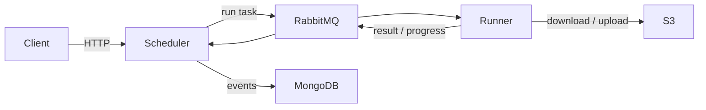

# re-do

A distributed scheduler for **Task Execution Graphs (TEGs)**: directed acyclic graphs of tasks where each task
consumes artefacts produced by its predecessors.

## What it does

- Accepts a TEG over an HTTP API.
- Validates the graph (no cycles, unique names, all inputs producible).
- Dispatches ready tasks to runners over RabbitMQ.
- Persists state in MongoDB as an append-only event log.
- Stores file artefacts in S3-compatible storage.
- Retries failed tasks (configurable, default 3) and detects timeouts.

## When to use it

You have a workflow that:

- Has multiple steps with dependencies between them.
- Produces or consumes files of non-trivial size.
- Needs to be triggered from outside (HTTP) and observed (logs, events).
- Should fan out work across multiple workers.

## Where to start

- New here? Read [Getting started](getting-started.md), then [Concepts: TEG](concepts/teg.md).
- Integrating with the API? See [HTTP API](api/overview.md).
- Adding a new task type? See [Writing a task plugin](tasks/writing-a-task-plugin.md).
- Deploying? See [Operations](operations/deployment.md).

## Architecture in one diagram

See [Architecture overview](architecture/overview.md) for the full picture.
